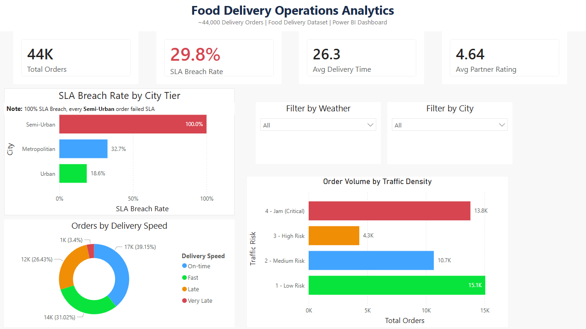
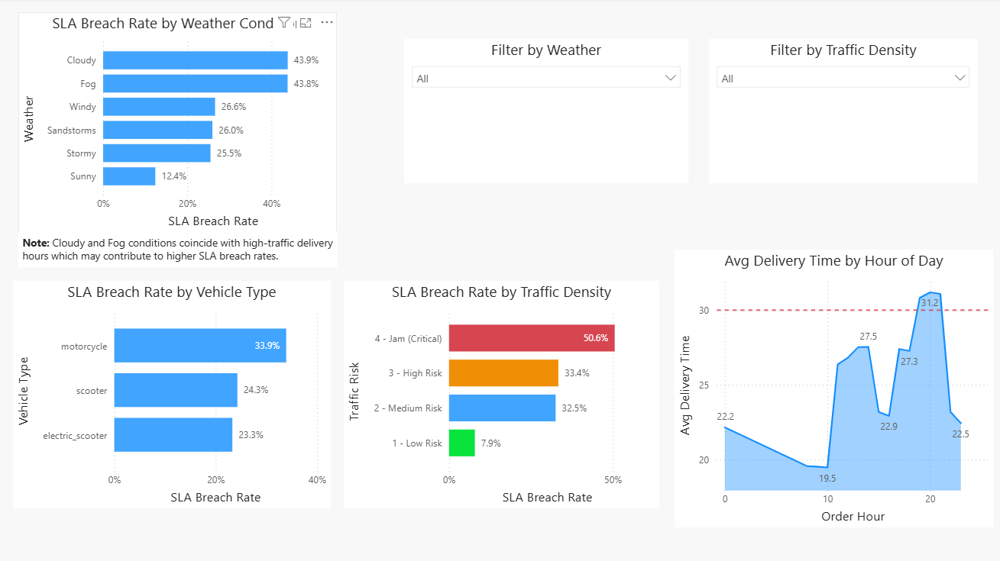
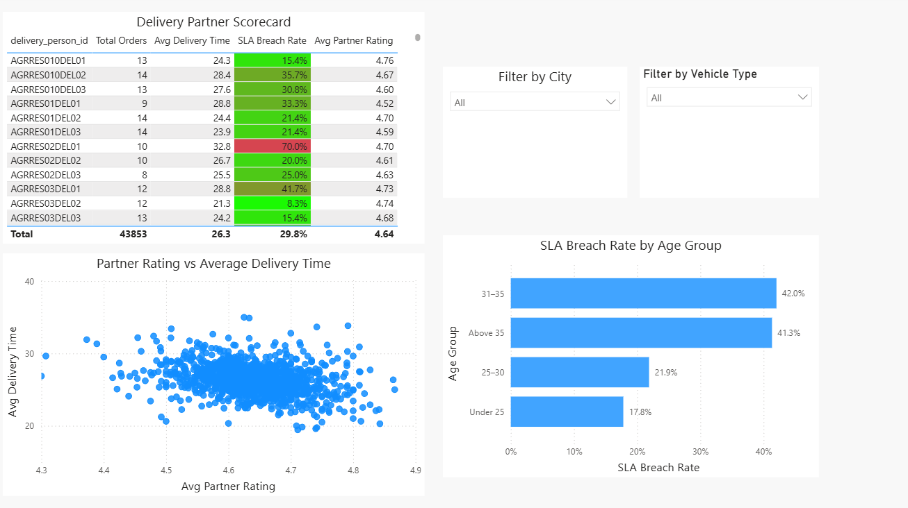
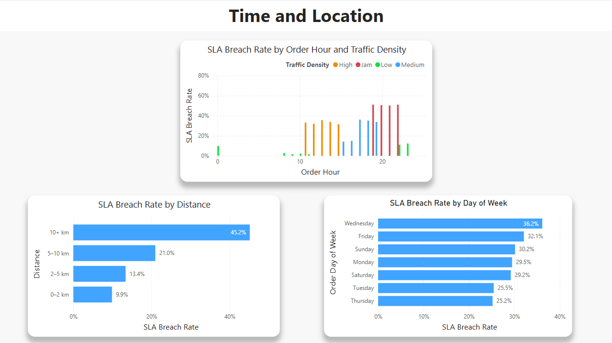
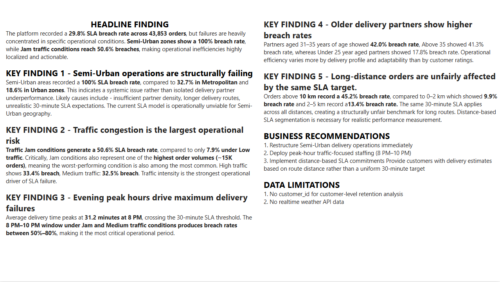

# Food Delivery Operations Analytics

Food delivery operations analytics project analyzing SLA breach patterns 
across 43,853 food delivery orders.

## Business Problem
A food delivery platform is breaching its 30-minute SLA on ~30% of orders.
This project identifies the key drivers and provides actionable operational recommendations.

## Key Findings
- 29.83% overall SLA breach rate (~13,081 orders affected)
- Semi-urban cities show highest structural breach rates
- 8-10 PM dinner window is peak breach period
- Cloudy and foggy weather push breach rates to ~44%

## Tools & Stack
| Layer | Tool |
|---|---|
| Data Cleaning | Python, pandas, numpy |
| SQL Analysis | postgresql, pgAdmin |
| EDA | pandas, matplotlib, seaborn |
| Dashboard | Power BI |
| Version Control | Git, GitHub |

## Project Structure
```text
food-delivery-ops-analytics/
├── notebooks/
│   ├── data_cleaning.ipynb
│   └── eda.ipynb
├── SQL/
│   ├── kpi_queries.sql
│   ├── window_functions.sql
│   └── ...
├── dashboard/
│   ├── food_delivery_dashboard.pbix
│   └── screenshots/
├── reports/
│   └── business_report.md
├── docs/
│   ├── problem_statement.md
│   ├── kpi_definitions.md
│   └── data_dictionary.md
└── README.md
```

## Dashboard Preview






## Business Report
See [reports/business_report.md](reports/business_report.md)

## Data Source
[Food Delivery Dataset - Kaggle](https://www.kaggle.com/datasets/saurabhbadole/zomato-delivery-operations-analytics-dataset)
> Raw data not included in repo. See data/README.md for download instructions.